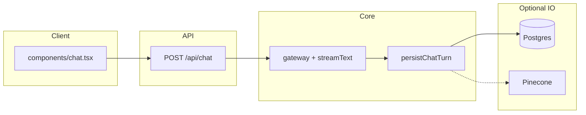

# Agent navigation — unified-ai-v1

Use this page as the **single entry point** for automated agents (and humans) who need to find code quickly. Authoritative command and architecture detail remains in [`CLAUDE.md`](../CLAUDE.md).

## Recommended read order

1. [`AGENTS.md`](../AGENTS.md) — workspace rules, secrets, Postgres URL shape, Composio usage patterns.
2. [`CLAUDE.md`](../CLAUDE.md) — build commands, request flow, API table, env groups, testing layout.
3. **This document** — where files live and which files to touch for common tasks.
4. Task-specific docs — e.g. [`CLIENT_ADAPTERS.md`](./CLIENT_ADAPTERS.md), [`architecture-one-pager.md`](./architecture-one-pager.md), [`unified-ai/README.md`](./unified-ai/README.md).

## Repo map

| Area | Role |
|------|------|
| [`app/`](../app/) | App Router pages (`page.tsx`, `dashboard/`), layouts, global styles. |
| [`app/api/`](../app/api/) | HTTP API: chat, models, tool-call audit, memory search, admin Composio sync. |
| [`components/`](../components/) | Client UI: chat shell, model selector, theme, shared UI primitives. |
| [`lib/`](../lib/) | Gateway wiring, chat persistence, DB, policies, Pinecone/Composio helpers. |
| [`__tests__/`](../__tests__/) | Vitest tests (mirrors `lib/` and `api/`). |
| [`drizzle/`](../drizzle/), [`drizzle.config.ts`](../drizzle.config.ts) | Drizzle schema push / migrations. |
| [`scripts/`](../scripts/) | Bootstrap checklist, DB URL validation, Composio sync script. |

Smaller codemaps: [`CODEMAPS/README.md`](./CODEMAPS/README.md).

## Task → files

| Task | Primary files |
|------|----------------|
| Change allowed models or defaults | [`lib/constants.ts`](../lib/constants.ts) |
| Change task-based routing (`taskTag`) | [`lib/model-policy.ts`](../lib/model-policy.ts), [`app/api/chat/route.ts`](../app/api/chat/route.ts) |
| Change chat persistence, usage rows, message previews | [`lib/chat-logging.ts`](../lib/chat-logging.ts), [`lib/db/schema.ts`](../lib/db/schema.ts) |
| Change AI Gateway provider options (tags, user id) | [`lib/gateway-options.ts`](../lib/gateway-options.ts) |
| Change tool-call audit contract or allowlist | [`app/api/tool-call/route.ts`](../app/api/tool-call/route.ts), [`lib/tool-policy.ts`](../lib/tool-policy.ts) |
| Change session creation semantics | [`lib/db/sessions.ts`](../lib/db/sessions.ts) |
| Pinecone summary upsert / search | [`lib/pinecone-summary.ts`](../lib/pinecone-summary.ts), [`app/api/memory/search/route.ts`](../app/api/memory/search/route.ts) |
| Composio catalog sync | [`lib/composio-sync.ts`](../lib/composio-sync.ts), [`app/api/admin/sync-composio/route.ts`](../app/api/admin/sync-composio/route.ts), [`scripts/sync-composio.ts`](../scripts/sync-composio.ts) |
| Composio Neon + Supabase storage workflows | [`docs/COMPOSIO_NEON_SUPABASE.md`](./COMPOSIO_NEON_SUPABASE.md), [`AGENTS.md`](../AGENTS.md) (Composio bullet) |
| Full transcript storage | [`lib/supabase-storage.ts`](../lib/supabase-storage.ts) (with env from [`.env.example`](../.env.example)) |
| Chat UI behavior (session id, model param, `useChat`) | [`components/chat.tsx`](../components/chat.tsx) |

## Verification commands

Run from repo root (see [`package.json`](../package.json)):

```bash
pnpm type-check
pnpm lint
pnpm test
pnpm build
```

Single-file test example: `pnpm vitest run __tests__/lib/model-policy.test.ts`

## High-level request path (chat)

For the full ASCII sequence (headers, `onFinish`, etc.), see [`CLAUDE.md`](../CLAUDE.md). The diagram below is a compact view for orientation.



## Adoption and porting

To run this app as-is or embed its pieces in another repository, see [`ADOPTION_PORTING.md`](./ADOPTION_PORTING.md).
